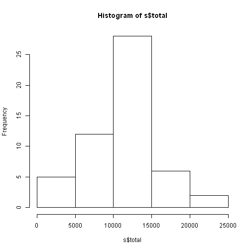
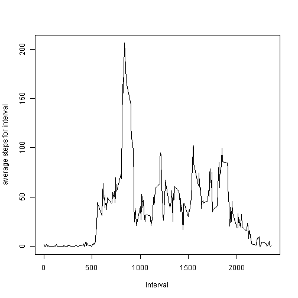
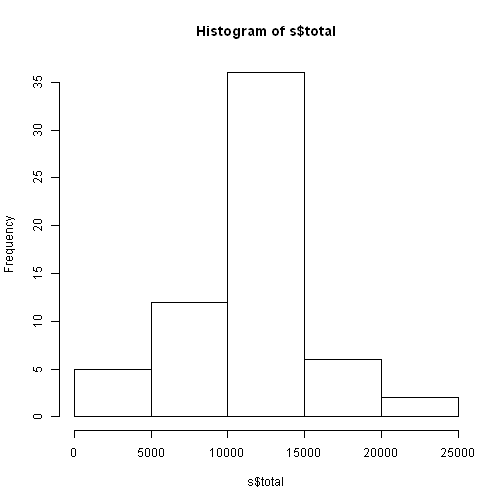
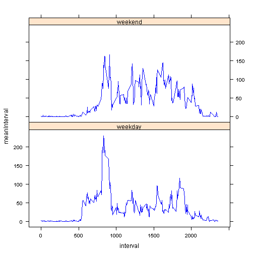

## Loading and preprocessing the data


```r
dir.create("activity")
a<-unzip("activity.zip",exdir="activity")
data<-read.csv("activity/activity.csv",colClasses="character")
library(dplyr)
```

```
## 
## Attaching package: 'dplyr'
## 
## The following objects are masked from 'package:stats':
## 
##     filter, lag
## 
## The following objects are masked from 'package:base':
## 
##     intersect, setdiff, setequal, union
```

```r
data[,2]<-as.Date(data[,2],"%Y-%m-%d")
data[,3]<-as.numeric(data[,3])
data[,1]<-as.numeric(data[,1])
data2<-subset(data,!is.na(data[,1]))
```

## What is mean total number of steps taken per day?

```r
s<-summarise(group_by(data2,date),total=sum(steps))
hist(s$total)
```

 

```r
summarise(group_by(data2,date),mean=mean(steps))
```

```
## Source: local data frame [53 x 2]
## 
##          date     mean
## 1  2012-10-02  0.43750
## 2  2012-10-03 39.41667
## 3  2012-10-04 42.06944
## 4  2012-10-05 46.15972
## 5  2012-10-06 53.54167
## 6  2012-10-07 38.24653
## 7  2012-10-09 44.48264
## 8  2012-10-10 34.37500
## 9  2012-10-11 35.77778
## 10 2012-10-12 60.35417
## ..        ...      ...
```

```r
summarise(group_by(data2,date),median=median(steps))
```

```
## Source: local data frame [53 x 2]
## 
##          date median
## 1  2012-10-02      0
## 2  2012-10-03      0
## 3  2012-10-04      0
## 4  2012-10-05      0
## 5  2012-10-06      0
## 6  2012-10-07      0
## 7  2012-10-09      0
## 8  2012-10-10      0
## 9  2012-10-11      0
## 10 2012-10-12      0
## ..        ...    ...
```


## What is the average daily activity pattern?

```r
v<-summarise(group_by(data2,interval),meanInterval=mean(steps))
plot(v$interval,v$meanInterval,type="l",xlab="Interval",ylab="average steps for interval")
```

 

```r
filter(v,meanInterval==max(v$meanInterval))
```

```
## Source: local data frame [1 x 2]
## 
##   interval meanInterval
## 1      835     206.1698
```


## Inputing missing values

```r
missing<-subset(data,is.na(data[,1]))
nrow(missing)
```

```
## [1] 2304
```

```r
i<-1
for(k in 1:8)
{
for(j in 1:288)
{
missing$steps[i]<-v$meanInterval[j]
i<-i+1
}
}
Final<-rbind(data2,missing)
Final<-arrange(Final,date)
s<-summarise(group_by(Final,date),total=sum(steps))
hist(s$total)
```

 

```r
summarise(group_by(Final,date),mean=mean(steps))
```

```
## Source: local data frame [61 x 2]
## 
##          date     mean
## 1  2012-10-01 37.38260
## 2  2012-10-02  0.43750
## 3  2012-10-03 39.41667
## 4  2012-10-04 42.06944
## 5  2012-10-05 46.15972
## 6  2012-10-06 53.54167
## 7  2012-10-07 38.24653
## 8  2012-10-08 37.38260
## 9  2012-10-09 44.48264
## 10 2012-10-10 34.37500
## ..        ...      ...
```

```r
summarise(group_by(Final,date),median=median(steps))
```

```
## Source: local data frame [61 x 2]
## 
##          date   median
## 1  2012-10-01 34.11321
## 2  2012-10-02  0.00000
## 3  2012-10-03  0.00000
## 4  2012-10-04  0.00000
## 5  2012-10-05  0.00000
## 6  2012-10-06  0.00000
## 7  2012-10-07  0.00000
## 8  2012-10-08 34.11321
## 9  2012-10-09  0.00000
## 10 2012-10-10  0.00000
## ..        ...      ...
```
The values estimated above are definitely different from the first part of the assignment. Adding the missing values have increased the y axis level to 35 whereas in the first part of the assignment the y axis level was 25.
 
## Are there differences in activity patterns between weekdays and weekends?

```r
F<-mutate(Final,day=factor("weekday",levels=c("weekday","weekend")))
for(i in 1:17568)
{
if(weekdays(F[i,2])=="Sunday" || weekdays(F[i,2])=="Saturday"){F[i,4]<-"weekend"} else{F[i,4]<-"weekday"}
}
v<-summarise(group_by(F,day,interval),meanInterval=mean(steps))
library(lattice)
xyplot(meanInterval~interval|day,data=v,type="l",col="blue",layout=c(1,2))
```

 
